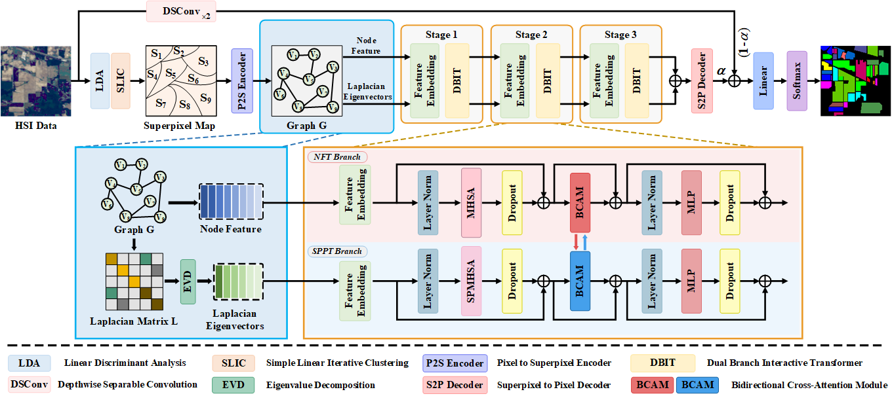

# 📖 SPGFormer: Structure Perception Graph Transformer with Laplacian Position Encoding for Hyperspectral Image Classification (TGRS 2025)

Demo code of ["SPGFormer: Structure Perception Graph Transformer with Laplacian Position Encoding for Hyperspectral Image Classification"](https://ieeexplore.ieee.org/document/11126175)

- Authors: Jinliang An, Longlong Dai, Muzi Wang, Weidong Zhang and Xiangrong Zhang

### 🧩 Overall
<div align=center>

</div>

### 🥰 Citation	

**Please kindly cite the papers if this code is useful and helpful for your research.**
```
@ARTICLE{11126175,
  author={An, Jinliang and Dai, Longlong and Wang, Muzi and Zhang, Weidong and Zhang, Xiangrong},
  journal={IEEE Transactions on Geoscience and Remote Sensing}, 
  title={SPGFormer: Structure Perception Graph Transformer with Laplacian Position Encoding for Hyperspectral Image Classification}, 
  year={2025},
  volume={},
  number={},
  pages={1-1}
}
```

